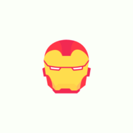

<h1 align="center">Marvel Heroes</h1>

Diversos personagens do universo marvel em um único lugar. 

  

## Sobre :pencil:

O projeto foi iniciado por meio de um [desafio](https://github.com/Lorenalgm/marvel-heroes). Inicialmente o desafio foi para desenvolver um aplicativo mobile, mas resolvi fazer um na web, logo boa parte do layout funciona melhor no mobile.

## Tecnologias usadas :rocket:

- [React](https://pt-br.reactjs.org/)
- [Next](https://nextjs.org/)
- [Typescript](https://www.typescriptlang.org/)
- [Styled Components](https://styled-components.com/)
- [Jest](https://jestjs.io/pt-BR/)
- [React Testing Library](https://testing-library.com/docs/react-testing-library/intro/)
- [Graphql](https://graphql.org/)

## Funcionalidades :video_game:

- Visualização de personagens da marvel.
- Visualização de páginas de personagens com nome, biografia, imagem, entre outros.
- Utilização de um CMS para controle de conteúdo. 

## Imagens ✨

  

  

  

## Agradecimentos :heart:

- [Repositório com o desafio](https://github.com/Lorenalgm/marvel-heroes)
- [Layout](https://www.figma.com/community/file/849367817302905364)
